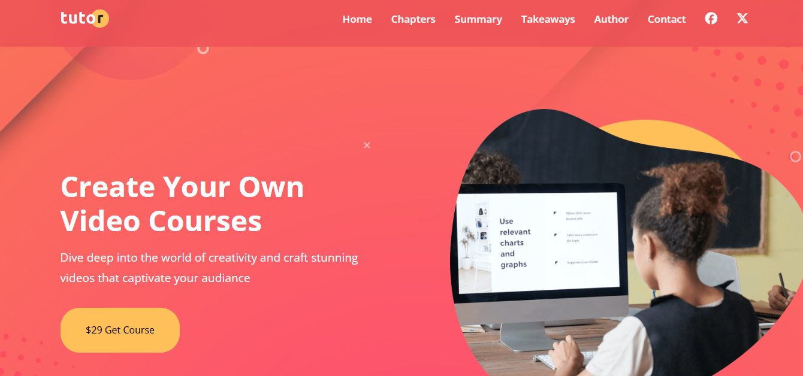
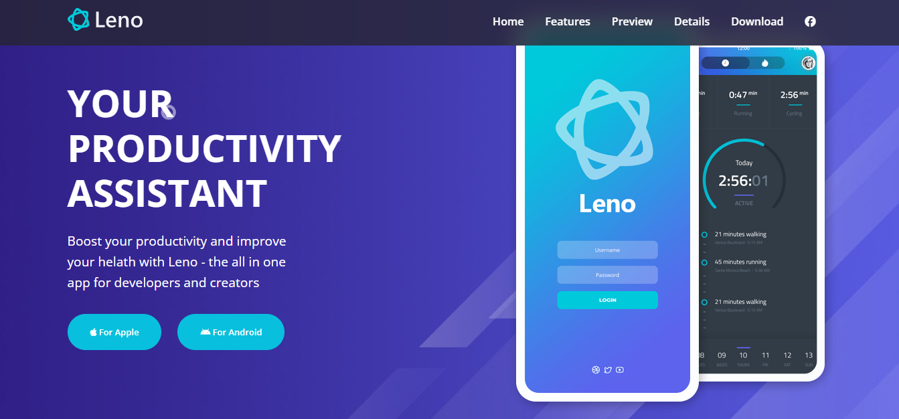
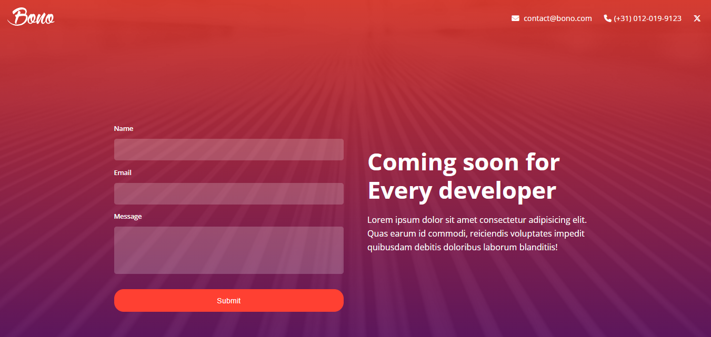
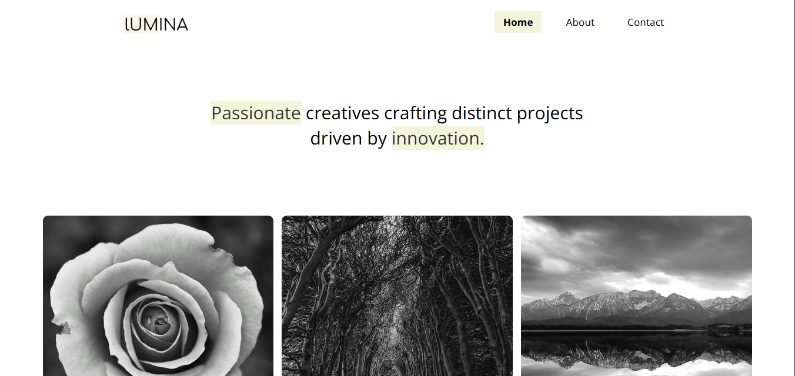

# Frontend Course Projects

This repository contains projects done during the Udemy frontend course. Below is a catalog of all the projects with links to the live demos and source code.

## Index

1. [Tutor Website](#tutor-website)
2. [Leno Website](#leno-website)
3. [Bono Website](#bono-website)
4. [Lumina Website](#lumina-website)

---

## Tutor Website

- [Source Code](./tutor-website/index.html)
- [Live Demo](https://afaiyaz006.github.io/frontend-course/tutor-website/)

## Leno Website

- [Source Code](./tutor-website/index.html)
- [Live Demo](https://afaiyaz006.github.io/frontend-course/leno-project/)

## Bono Website

- [Source Code](./bono-project/index.html)
- [Live Demo](https://afaiyaz006.github.io/frontend-course/bono-project/)

## Lumina Website

- [Source Code](./lumina-website/index.html)
- [Live Demo](https://afaiyaz006.github.io/frontend-course/lumina-website/)
